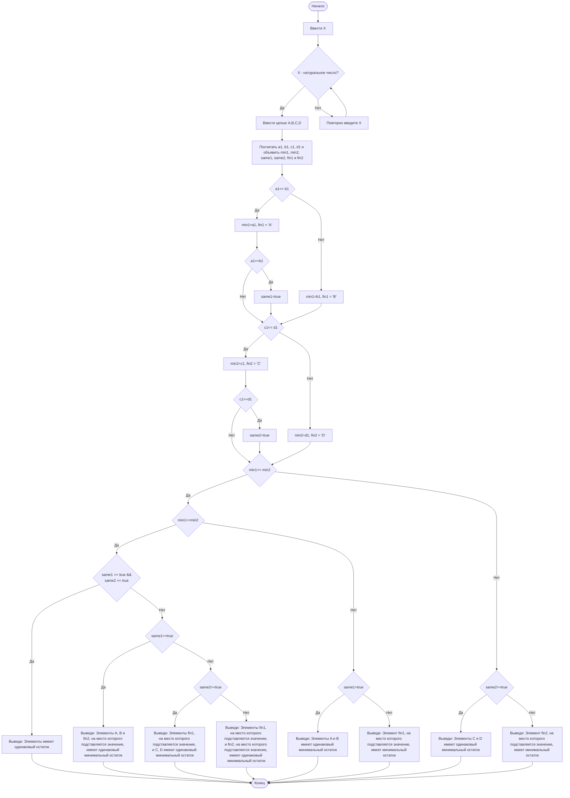

## Отчет по лабораторной работе № 1

#### № группы: `ПМ-2401`

#### Выполнил: `Москвитин Марк Александрович`

#### Вариант: `17`

### Cодержание:

- [Постановка задачи](#1-постановка-задачи)
- [Входные и выходные данные](#2-входные-и-выходные-данные)
- [Выбор структуры данных](#3-выбор-структуры-данных)
- [Алгоритм](#4-алгоритм)
- [Программа](#5-программа)
- [Анализ правильности решения](#6-анализ-правильности-решения)

### 1. Постановка задачи

> На вход программы подаются четыре целых чисел A, B, C, D. Необходимо определить число, имеющее наименьший остаток от деления на число X. На вход программы подаются натуральное число X и пять целых чисел A, B, C, D.

- Нам требуется создать алгоритм определения элемента с минимальным остатком от деления на натуральное число X среди введенных четырех целых чисел. Для этого воспользуемся условным оператором if.
- Несмотря на то, что по условию X - натуральное, необходимо отметить, что алгоритмом могут воспользоваться французы, записав 0, поэтому поставим небольшую так называемую защиту от дурака.
- Сначала вычислим остаток от деления на X, и запишем его в соответствующие значения. Постепенным сравнением определим минимальный остаток. 
- Объявим все необходимые переменные, которые понадобятся нам в будущем. 
- Определим минимальный остатков попарно среди остатков от A, B и C, D. Отдельно благодаря переменных логического типа обозначим возможность попарного равенства элементов.
- Далее сравним заранее определенные элементы с минимальным остатков, рассмотрев всевозможные случаи совпадения элементов. Введем название элемента благодаря символьному типу и посчитаем его. Выведем на экран нужный элемент, обозначив это в специальной фразе.

### 2. Входные и выходные данные

**Данные на вход**

По условии на вход нам падается четыре целых числа A,B,C,D и одно натуральное X, что вводится в рамках целочисленного типа данных.

|    Число    | Тип                | min значение    | max значение   |
|-------------|--------------------|-----------------|----------------|
|     X       |  Натуральное число |        1        |    +Infinity   |
|     A       |    Целое число     |    -Infinity    |    +Infinity   |
|     B       |    Целое число     |    -Infinity    |    +Infinity   |
|     C       |    Целое число     |    -Infinity    |    +Infinity   |
|     D       |    Целое число     |    -Infinity    |    +Infinity   |

**Данные на выход**

На выход представляется фраза, уточняющая контекст, в которую подставляется переменная типа char с обозначением, у какого из чисел минимальных остаток при делении на X.

В случае, при котором у элементов одинаковый остаток, выводится лишь специальная фраза.

### 3. Выбор структуры данных

Нам придется работать с целыми и натуральными числами, поэтому для их хранения воспользуемся переменными типо integer. Также не забудем про логические и символьные переменные, которые потребеются нам для проверки равенства в изначальных парах и выводе необходимого ответа.

|               |    Тип (в Java)    | min значение    | max значение   |  Название переменной  |
|---------------|--------------------|-----------------|----------------|-----------------------|
|       X       |      Integer       |        1        |   2147483647   |           X           |
|       A       |      Integer       |   -2147483648   |   2147483647   |           A           |
|       B       |      Integer       |   -2147483648   |   2147483647   |           B           |
|       C       |      Integer       |   -2147483648   |   2147483647   |           C           |
|       D       |      Integer       |   -2147483648   |   2147483647   |           D           |
| Остаток от A  |      Integer       |   -2147483648   |   2147483647   |           a1          |
| Остаток от B  |      Integer       |   -2147483648   |   2147483647   |           b1          |
| Остаток от C  |      Integer       |   -2147483648   |   2147483647   |           c1          |
| Остаток от D  |      Integer       |   -2147483648   |   2147483647   |           d1          |
| Min от a1,b1  |      Integer       |   -2147483648   |   2147483647   |          min1         |
| Min от c1,d1  |      Integer       |   -2147483648   |   2147483647   |          min2         |
|    a1 == b1   |      Boolean       |        -        |        -       |          same1        |
|    c1 == d1   |      Boolean       |        -        |        -       |          same2        |
|A / B - минимум|        Сhar        |        -        |        -       |          fin1         |
|C / D - минимум|        Сhar        |        -        |        -       |          fin2         |

### 4. Алгоритм
**Алгоритм работы программы**
1. Получаем на вход и считываем переменную **X**, выраженную натуральным числом. Проводим проверку на дурака: если ввод ровняется нулю, что допускается при нахождении во Франции, просим совершить пользователя повторный ввод.
2. Получаем на вход и считываем четыре целых числа **A, B, C, D.**
3. Создаем переменные **a1, b1, c1, d1**, для которых программа попеременно присваивает значения в виде остатков от деления **A, B, C, D** на **X**.
4. Объявляем переменные для программы, которые понадобятся нам в будущем: **min1** и **min2** (которым будет присвоено наименьшее значение среди пар **a1_b1** и **c1_d1** соответственно),**fin1** и **fin2** (которые будет присвоено имя минимального элемента в парах), а также логические переменные **same1** и **same2**, которые будут предназначены для ситуации равенства элементов в паре.
5. Программа начинает попарное сравнение. Сначала проверим условие  **a1<=b1**. Если оно является истинным, то **min1** будет присвоено значение **a1**, а **fin1** - **'A'**. Кроме этого, в этот момент будет дополнительно рассмотрено условие **a1==b1**. В случае его истинности, переменной **same1** будет присвоено значение **true**.
Однако если первое условие является ложным, то **min1** будет присвоено значение **b1**, а **fin1** - **'B'**.
6. Аналогично программа рассматривает **c1<=d1**, но уже с переменными **min2**, **same2** и **fin2**.
7. Теперь программа перейдет к рассмотрению  **min1<=min2**. Здесь нас ждут следующие варианты, если это условие истинно:
- Проверяем **min1==min2**. В случае истинности нам следует определить, какое именно количество элементов совпадает. Это проверяется по значениям переменных **same1** и **same2**. Если истины оба - выводим сообщением об одинаковом остатке, если верно только **same1** - выводим оба элемента первой пары и нужный элемент второй, если верно только **same2** - выводим оба элемента второй пары и нужный элемент первой.
- В случае ложного значения **min1==min2** программа проверяет значение **same1**, и в зависимости от этого выводит либо **fin1**, либо оба элемента первой пары.
- Если **min1<=min2** было ложно, то программа аналогично проверяет значение **same1**, и в зависимости от этого выводит либо **fin2**, либо оба элемента второй пары.

**Блок-схема**

### 5. Программа

### 6. Анализ правильности решения

